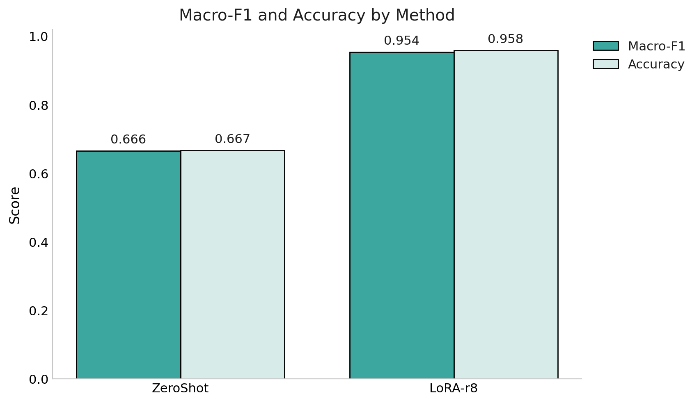
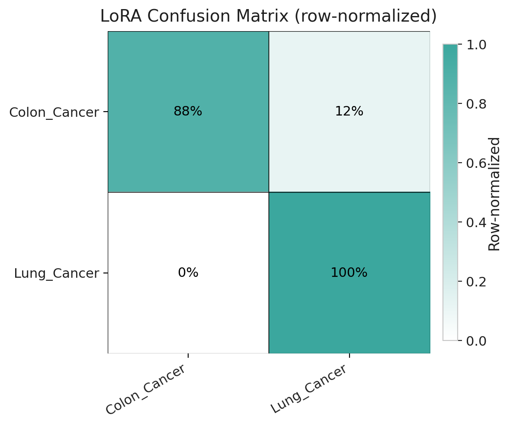
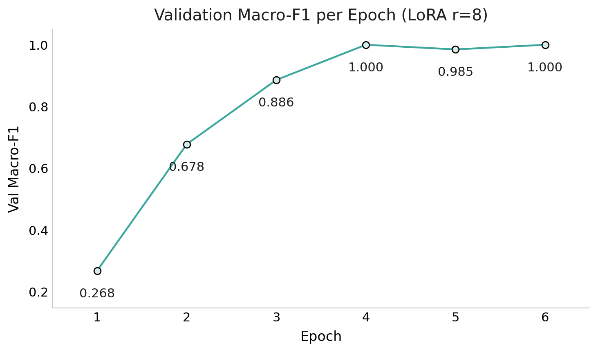
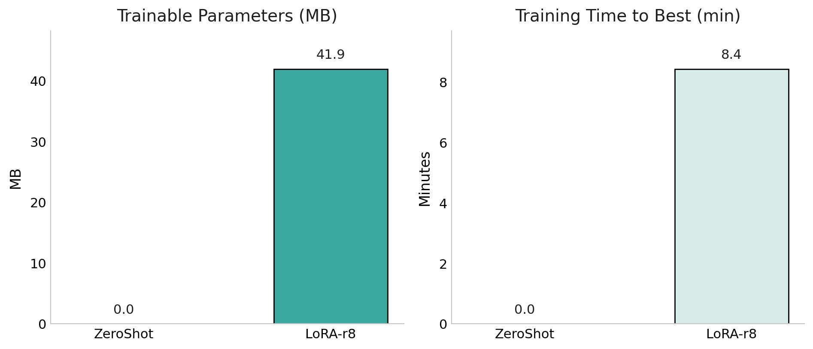

# LoRA Fine Tuning
> **LoRA (r=8)** lifts zero-shot **Macro-F1/Accuracy from 0.666/0.667 to 0.954/0.958** while training only **~42 MB** of adapters in **~8.4 min.**

## Inspiration
I wanted to do a LoRA because I wanted another way to tune a model without occuring computational costs and money. 

## Introduction
**LoRA (Low-Rank Adaptation)** fine-tunes a big model by freezing the original weights and learning tiny **adapters**—small add-on modules that nudge the model for your task. The adapter’s **rank** 𝑟 is just a knob for how big/expressive that add-on is: higher 𝑟 = more capacity; lower 𝑟 = smaller and faster. Because only the adapters learn (not the whole model), you train far fewer parameters, use less memory, and finish much quicker.

From a business view, LoRA cuts **GPU cost** and **time-to-value**, makes MLOps lighter (adapters are **small files** you can version, A/B, and roll back), and enables **safe personalization**—one vetted base model with per-client or per-use-case adapters you can swap in without touching production weights. That means faster iteration, easier governance, and scalable customization without duplicating the entire model.

Talk abour r= {8, 16}

## Dataset
The dataset was found on Kaggle. It is a cancer dataset that 

## Model
**`mistralai/Mistral-7B-Instruct-v0.3`** was the base model from [HuggineFace](https://huggingface.co/mistralai/Mistral-7B-Instruct-v0.3). It’s a compact, open-weights LLM with strong accuracy per parameter, so you get competitive zero-shot performance and a great starting point for small adapters. Because it’s memory- and compute-efficient, it fits comfortably on a single GPU and is LoRA-friendly;  can train tiny adapters quickly without touching the base weights. It's broad ecosystem support (tokenizer, checkpoints, PEFT compatibility) make it a practical, production-ready choice for fast iteration and low-cost customization.

## Workflow

## Metrics

Macro-F1

Accuracy

## Results: Table, Performance

## Results: Visuals
 LoRA (r=8) boosts performance from Macro-F1 0.666 / Accuracy 0.667 (zero-shot) to 0.954 / 0.958—about a +0.29 absolute gain on both metrics. The sizable Macro-F1 jump indicates the improvement is spread across classes rather than driven by one label. And because LoRA updates only a small adapter, this gain comes with minimal training overhead compared with full fine-tuning.

 
 

 Colon_Cancer is correctly predicted 88% of the time and misclassified as Lung_Cancer 12% of the time; Lung_Cancer is 100% correct with 0% misclassified as Colon.
High values on the diagonal indicate strong recall per class (perfect for Lung, near-perfect for Colon), and the only error type shown is Colon → Lung.

 
 

Validation Macro-F1 rises sharply from 0.268 → 0.678 → 0.886 by epoch 3 and reaches ~1.000 at epoch 4, with a tiny dip at epoch 5 before returning to 1.000 at epoch 6. The curve plateaus after epoch 4, indicating the model has effectively converged and extra epochs add little.

 
 

This panel shows the cost of adaptation. On the left, LoRA-r8 trains only about 42 MB of parameters (adapters), while ZeroShot trains none—highlighting that LoRA updates a tiny add-on rather than the whole model. On the right, LoRA reaches its best checkpoint in about 8.4 minutes, giving a quick turnaround for experiments.
Because LoRA learns small adapters, they’re fast to retrain, easy to store/share, and can be swapped without touching the frozen base model.

In practice, this is why LoRA: you get rapid task adaptation at low compute and storage cost, making iteration and deployment much lighter.

## Results: Table, Statistical Significance

## Next Steps:
 - Integrate **human-in-the-loop evaluations**, where the model proposes Cancer type and a pathologist confirms or corrects, and every false negative is escalated for immediate review.
 
 - **Plan a pilot study** using LoRA adapters on a single workflow (e.g., tumor-registry pre-labeling or pathology report triage).

## Conclusion
This project shows that a lightweight LoRA adapter can reliably **specialize a 7B base model for Lung vs Colon cancer classification**. With r=8, performance rose from Macro-F1/Accuracy 0.666/0.667 to 0.954/0.958, and the confusion matrix indicates the only notable residual error is Colon → Lung. Training touched only ~42 MB of parameters and converged in ~8.4 min, preserving the frozen base while delivering a large improvement. These results justify moving to a focused pilot with human-in-the-loop review, slice monitoring, and adapter variants per site/service line.

# Tech Stack
Python, CUDA GPU, PyTorch, Transformers, LLM, scikit-learn, pandas, numpy, matplotlib.